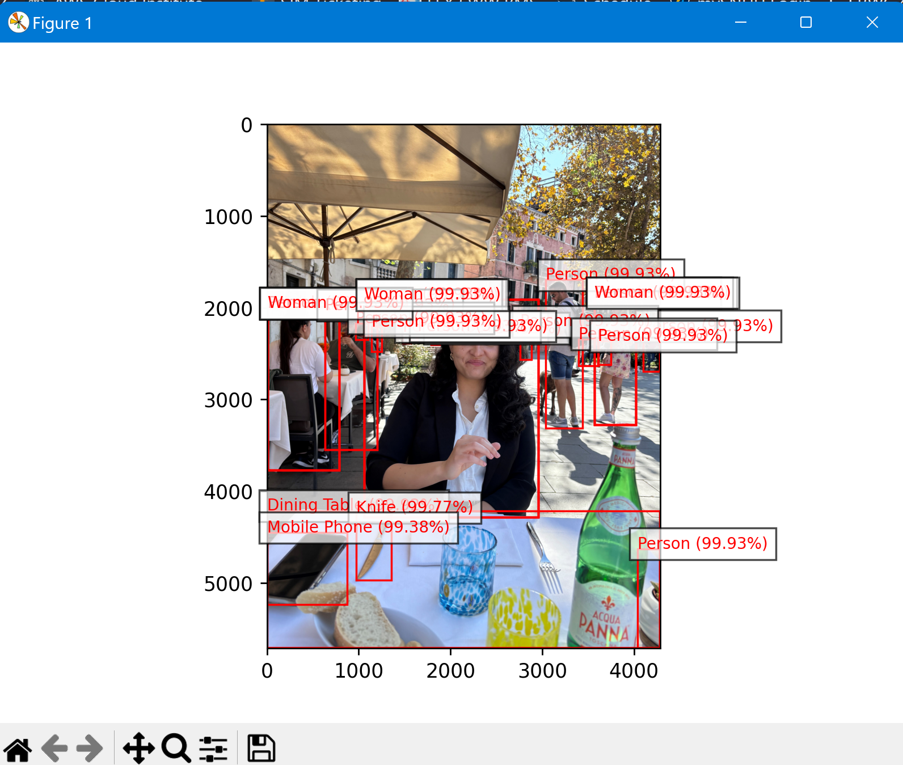
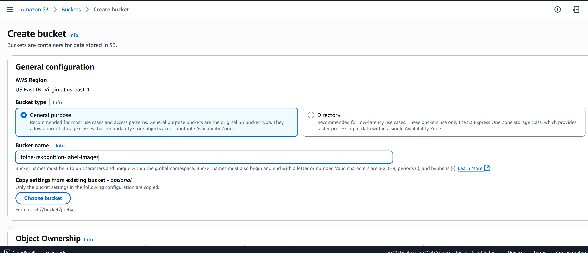
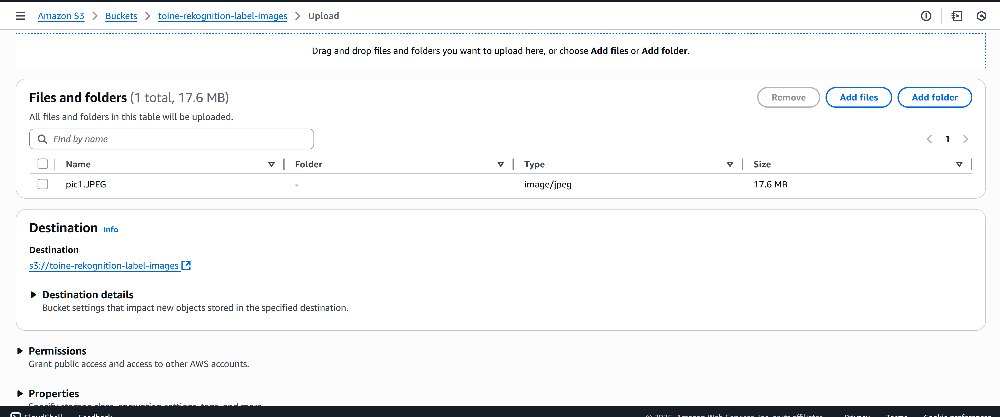
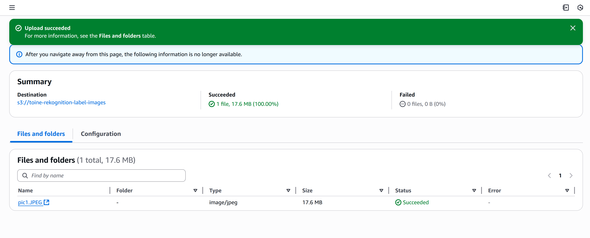
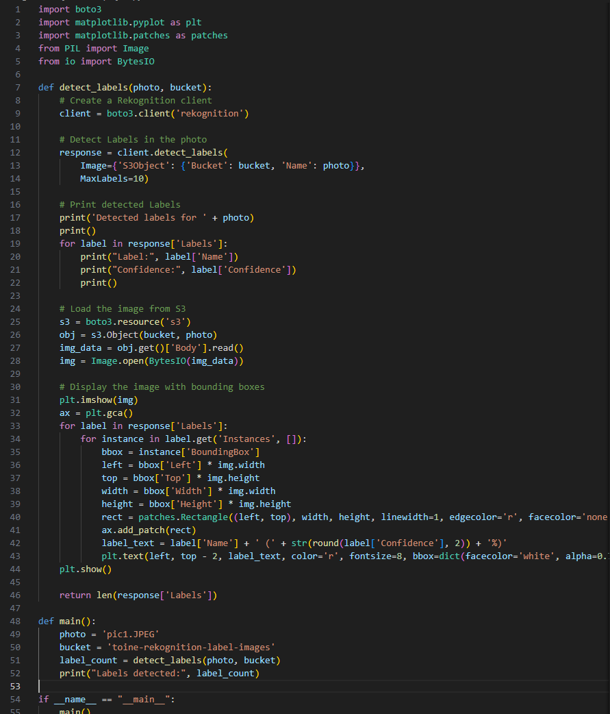
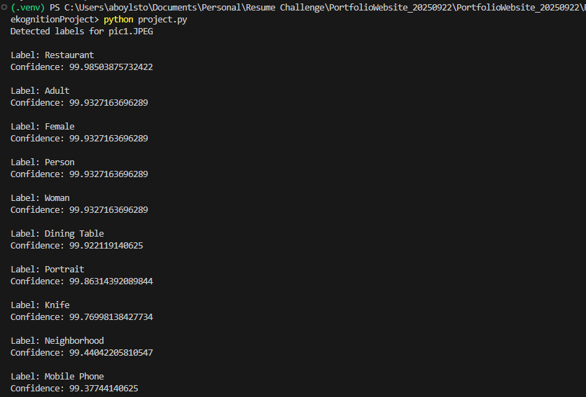

## Project Overview ☁️

This project walks through building an **Image Label Generator** using **Amazon Rekognition**. Given an image (stored in **Amazon S3**), Rekognition is called to detect objects then returns labels with confidence scores. For example, a casual lunch photo can yield labels like *tableware*, *bottle*, or *person* with their confidences.

---

## Roadmap

We’ll go through the following steps:

1. Create an **Amazon S3** bucket  
2. Upload sample images to S3  
3. Install and **configure the AWS CLI**  
4. Set up a **Python virtual environment** and install dependencies (`boto3`)  
5. Implement a `detect_labels` function  
6. Add a `main` entry point to call it  
7. Run the Python script and review the output
8. (Optional) Teardown to clean up resources.


---

## Final Result

  


---

## Services Used 🛠

| Service            | Purpose                                           | Notes                                  |
|--------------------|---------------------------------------------------|----------------------------------------|
| **Amazon S3**      | Store input images                                | Keep bucket and Rekognition **regions aligned** |
| **Amazon Rekognition** | Analyze images and return labels                | Pay-per-use; Free Tier eligibility may apply |
| **AWS CLI**        | Interact with AWS from the terminal               | Verify credentials/region; manage S3   |

---

## Estimated Time & Cost

> ⚠️ Approximations only. 

**Build Time (one-time):**
| Phase              | Estimate      |
|--------------------|---------------|
| Planning           | ~10 min       |
| Provision infra    | ~10 min       |
| App/deploy & tests | ~20 min       |

**Monthly Cost (steady state):**
| Component            | Qty | $/Month (est.) | Notes                                   |
|---------------------|-----|----------------|-----------------------------------------|
| S3 bucket           | 1   | ~$0–$1         | Depends on storage/requests             |
| Amazon Rekognition  | —   | ~$0–$1         | Depends on number of images analyzed    |
| AWS CLI             | —   | $0             | CLI tool itself is free                 |
| **Total (est.)**    |     | **~$0–$2**     | Small tests typically cost pennies      |

---

## Architecture Diagram


---

## Prerequisites

- AWS account with permissions for S3 and Rekognition  
- **AWS CLI v2** installed and configured (`aws --version`, `aws sso login` or access keys)  
- **Python 3.x** and `boto3` (recommend a virtual environment)

---

# Let’s Build!

## Create an Amazon S3 Bucket

1. Sign in to the **AWS Management Console**.
2. Open **Amazon S3** from the search bar.
3. Click **Create bucket**.
   
   

4. Enter a **globally unique** bucket name (lowercase letters, numbers, and hyphens only) and choose the **region**.
   - Tip: Pick the **same region** you’ll use for **Amazon Rekognition** and your CLI/session to avoid region-mismatch errors.
5. Leave **Block all public access** enabled (recommended). Optionally enable **Versioning** and default encryption (**SSE-S3**).
6. Click **Create bucket**. You’ll use this bucket to store the images that Rekognition will analyze. Next, upload a few sample images to this bucket.

## Upload Sample Images to S3

1. Open your new **S3 bucket**.
2. Click **Upload** → **Add files** and select the images you want to analyze.
   - Prefer **JPEG/PNG**.
   - Avoid spaces in filenames (use `kebab-case`), and keep names lowercase for consistency.
3. (Optional) Set a folder prefix (key) like `images/` to keep things organized.
4. Leave the default settings (encryption on, public access blocked), then click **Upload**.



5. After the upload completes, you should see the objects listed in the bucket.



> **Tip:** Rekognition reads the object by its **S3 key**. If you used a folder, your key will look like `images/photo-01.jpg`. Keys are **case-sensitive**.

### Optional: Upload via AWS CLI
If you have the AWS CLI configured:

```bash
# Upload a single file
aws s3 cp ./samples/photo-01.jpg s3://<your-bucket>/images/photo-01.jpg --profile <your-profile>

# Or upload a whole folder of images
aws s3 cp ./samples/ s3://<your-bucket>/images/ --recursive --exclude "*" --include "*.jpg" --include "*.png" --profile <your-profile>
```
## Install and Configure the AWS CLI

### 1) Install AWS CLI v2

**Windows (PowerShell)**
```powershell
# Option A: with winget (if available)
winget install Amazon.AWSCLI

# Option B: download and run AWSCLIV2.msi, then reopen your terminal
```

**macOS**
```bash
# Using Homebrew
brew install awscli
# Or install the official AWSCLIV2.pkg, then reopen your terminal
```

**Linux**
```bash
# Official installer (x86_64)
curl "https://awscli.amazonaws.com/awscli-exe-linux-x86_64.zip" -o awscliv2.zip
unzip awscliv2.zip
sudo ./aws/install
```

**Verify the install**
```bash
aws --version
```

---

### 2) Configure Credentials

Authenticate with **IAM Identity Center (SSO)** (recommended) or **access keys**.

**A) SSO (recommended)**
```bash
# Create an SSO profile interactively
aws configure sso

# Log in via the browser for that profile
aws sso login --profile <your-profile>

# Test
aws sts get-caller-identity --profile <your-profile>
```

**B) Access keys**
```bash
aws configure
# Enter: Access Key ID, Secret Access Key, Default region (e.g., us-east-1), Default output (json)

# Test
aws sts get-caller-identity
```

> **Tips**
> - Use a default output of `json`.  
> - Choose a region that matches your **S3 bucket** and **Rekognition** region.  
> - To use a specific profile for a session:  
>   - **PowerShell:** `$env:AWS_PROFILE = "<your-profile>"`  
>   - **bash/zsh:** `export AWS_PROFILE="<your-profile>"`

---

### 3) Troubleshooting

- **Token expired (SSO):**
  ```bash
  aws sso login --profile <your-profile>
  ```
- **Unknown output type:**
  ```bash
  aws configure set output json --profile <your-profile>
  ```
- **`aws` not recognized:** close & reopen the terminal; confirm:
  ```bash
  aws --version
  ```
---
## Set Up a Python Virtual Environment & Install Dependencies

1. **Create a project virtual environment**

   **Windows (PowerShell)**
   ```powershell
   py -m venv .venv
   .\.venv\Scripts\Activate.ps1
   ```

   **macOS / Linux (bash/zsh)**
   ```bash
   python3 -m venv .venv
   source .venv/bin/activate
   ```

2. **Upgrade `pip` and install libraries**

   We’ll use:
   - `boto3` for AWS SDK
   - `matplotlib` for visualization
   - `Pillow` for image handling (the modern fork of PIL)

   ```bash
   python -m pip install --upgrade pip
   python -m pip install boto3 matplotlib pillow
   ```

3. **Import the libraries**

   ```python
   import boto3
   import matplotlib.pyplot as plt
   import matplotlib.patches as patches
   from PIL import Image
   from io import BytesIO
   ```

---

### `detect_labels` Function

This function takes an **S3 object key** (`photo_key`) and **bucket name** (`bucket`), calls **Amazon Rekognition** to detect labels, and then draws bounding boxes (when available) over the image.

> ⚠️ Make sure your **AWS CLI / SDK region** matches the **bucket’s region** (or pass `region` explicitly).

```python
import boto3
import matplotlib.pyplot as plt
import matplotlib.patches as patches
from PIL import Image
from io import BytesIO

def detect_labels(photo, bucket):
    client = boto3.client('rekognition')

    response = client.detect_labels(
        Image={'S3Object': {'Bucket': bucket, 'Name': photo}},
        MaxLabels=10)

    print('Detected labels for ' + photo) 
    print()   

    # Print label information
    for label in response['Labels']:
        print("Label:", label['Name'])
        print("Confidence:", label['Confidence'])
        print()

    # Load the image from S3
    s3 = boto3.resource('s3')
    obj = s3.Object(bucket, photo)
    img_data = obj.get()['Body'].read()
    img = Image.open(BytesIO(img_data))

    # Display the image
    plt.imshow(img)
    ax = plt.gca()

    # Plot bounding boxes
    for label in response['Labels']:
        for instance in label.get('Instances', []):
            bbox = instance['BoundingBox']
            left = bbox['Left'] * img.width
            top = bbox['Top'] * img.height
            width = bbox['Width'] * img.width
            height = bbox['Height'] * img.height

            rect = patches.Rectangle((left, top), width, height, linewidth=1, edgecolor='r', facecolor='none')
            ax.add_patch(rect)

            label_text = label['Name'] + ' (' + str(round(label['Confidence'], 2)) + '%)'
            plt.text(left, top - 2, label_text, color='r', fontsize=8, bbox=dict(facecolor='white', alpha=0.7))

    plt.show()

    return len(response['Labels'])

```

---

### `main` Function

Update `photo_key` and `bucket` to match your uploaded object and S3 bucket name.

```python
def main():
    photo = 'image_file_name'
    bucket = 'bucket_name'
    label_count = detect_labels(photo, bucket)
    print("Labels detected:", label_count)

if __name__ == "__main__":
    main()
```
Example of full code:


---

### Run It

```bash
# From your project folder with the venv activated
python your_script_name.py
```
You should see **up to 10 labels** (because `MaxLabels=10`) printed with confidence scores in the terminal. A window will open displaying the S3 image; **bounding boxes** are drawn for labels that include object *instances* (scene-only labels may not have boxes).




> **Troubleshooting quick wins**
> - **Token expired (SSO):** `aws sso login --profile <your-profile>`
> - **Region mismatch:** ensure CLI/SDK region matches the bucket/Rekognition region.
> - **InvalidS3Object/AccessDenied:** confirm the key (path + filename) and IAM permissions (`s3:GetObject`, `rekognition:DetectLabels`).
> - **Local file instead of S3?** Use `Image={"Bytes": open("local.jpg","rb").read()}` in `detect_labels()`.


## Conclusion & Teardown

### What you built
- An **Image Label Generator** using **Amazon Rekognition** that reads images from **S3**, returns labels with confidence scores, and (when available) draws **bounding boxes** over detected objects.
- A small Python script you can extend for batch processing, exporting results, or integrating into other apps.

---

### Clean Up (avoid charges)

**Console (easiest)**
1. Open **S3** → your bucket → **Empty** (to delete all objects).  
2. Back to the bucket list → select your bucket → **Delete**.  
> If **Versioning** is enabled, use **Empty** → **Permanently delete** in the console to remove all versions, then delete the bucket.

**CLI – Windows (PowerShell)**
```powershell
$Bucket  = "your-bucket-name"   # <-- change me
$Region  = "us-east-1"          # <-- match your bucket
$Profile = "your-profile"       # optional if you use profiles

# 1) Remove all objects
aws s3 rm "s3://$Bucket" --recursive --region $Region --profile $Profile

# 2) Delete the bucket
aws s3api delete-bucket --bucket $Bucket --region $Region --profile $Profile
```

**CLI – macOS/Linux (bash/zsh)**
```bash
BUCKET="your-bucket-name"   # <-- change me
REGION="us-east-1"          # <-- match your bucket
PROFILE="your-profile"      # optional

# 1) Remove all objects
aws s3 rm "s3://$BUCKET" --recursive --region "$REGION" --profile "$PROFILE"

# 2) Delete the bucket
aws s3api delete-bucket --bucket "$BUCKET" --region "$REGION" --profile "$PROFILE"
```

> **Note:** Rekognition itself has no persistent resources for this example, so there’s nothing to tear down there. S3 storage is the main ongoing cost.

---

### Local Cleanup (optional)
- Deactivate your virtual environment:  
  - **PowerShell:** `deactivate`  
  - **bash/zsh:** `deactivate`
- Remove the `.venv/` folder if you no longer need it.
- Delete any temporary files (e.g., saved plots).

---

### Next Steps (optional enhancements)
- Accept **local files** via `Image={"Bytes": ...}` and skip S3.  
- Export results to **JSON/CSV** for analysis.  
- Add CLI flags with `argparse` (e.g., `--bucket`, `--key`, `--min-confidence`).  
- Wire into a CI job or a Lambda function for serverless processing.
